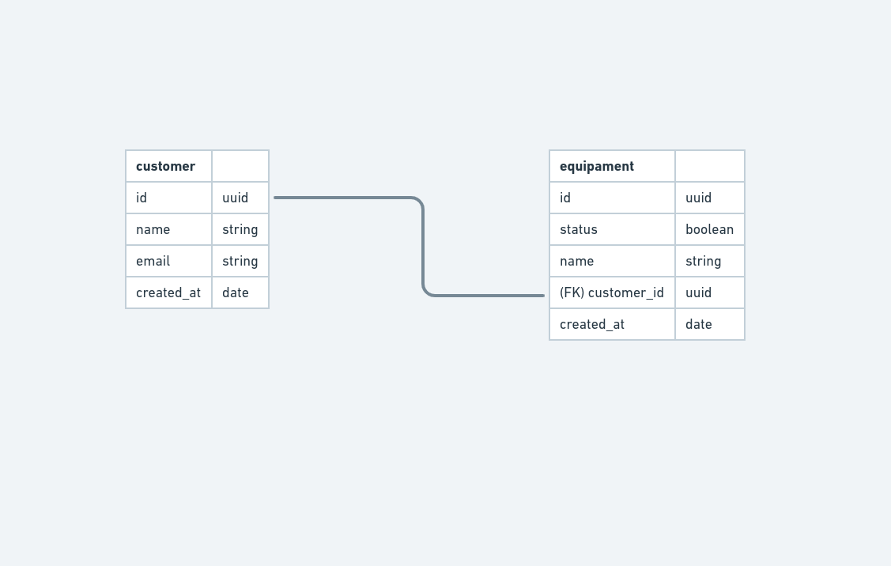

### Objetivo

- Implementar um cadastro de usuários e equipamentos com a possibilidade de cadastrar muitos equipamentos para um usuário (ManyToOne).
O teste será implementado com o TypeORM para estudos.

- Schema Database


### Cadastro de cliente

**RF**
- Deve ser possível cadastrar um novo cliente


### Deletar cliente

**RF**
- Deve ser possível deletar um cliente.

**RN**
- Os equipamentos associados ao cliente em questão não devem ser apagados e o identificar do cliente setado para NULL.

### Cadastro de equipamento

**RF**
- Deve ser possível cadastrar um equipamento associado a um cliente por seu ID.


### Deletar equipamento

**RF**
- Deve ser possível deletar um equipamento.

**RN**
- O cliente associado não deve sofrer alteração no banco após deletarmos o equipamento.


# Como executar

- Clone o repositório
- Suba o container com 
```bash
docker-compose up
```

A aplicação pode ser acessada em [`localhost:3333`](http://localhost:3333).